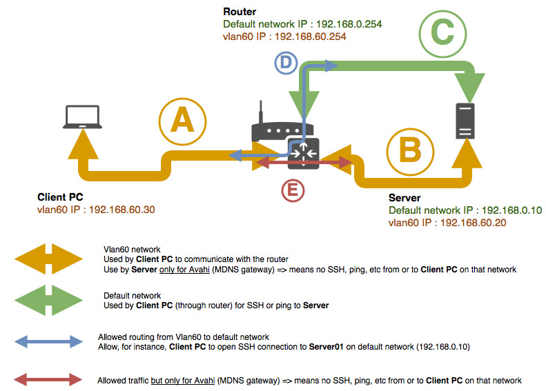

# Incoming traffic from an interface wrongly outgoing to an another interface

Example : 

 

* Default network :
   * network IP: `192.168.0.0/24`
   * gateway: `192.168.0.254`
 * Vlan60 network :
   * network IP: `192.168.60.0/24`
   * gateway: `192.168.60.254`
 * Server
   * eth0 interface is on default network (IP: `192.168.0.10`)
     * :warning: By default, your system will add a routing rule saying that all packet from `192.168.0.0/24` will go through **eth0 interface**
   * vlan60 interface is on vlan60 network (IP: `192.168.60.20`)
     * :warning: By default, your system will add a routing rule saying that all packet from `192.168.60.0/24` will go through **vlan60 interface**
 * Client PC is on vlan60 network (IP: `192.168.60.30`)

Let's say 
  * vlan60 interface on **Server** is only made to be used by avahi (see [there](../../avahi/doc/airplay_gateway_over_vlans.md)), and so not for ssh for instance.
  * but you also want to allow ssh from **Server** for device that are in **Vlan60** network. 
    
    Furthermore, by security (and because of first point), you want to manage those accesses from your router and so you allow ssh to **Server** only with it's default network IP (`192.168.0.10`)

In case you try a ssh connection from **Client PC** to **Server** with IP `192.168.0.10`, packets will transit through your router to eventually goes to **Server** and then going through **eth0 interface** (as `192.168.0.10` is the IP of that interface).

Unfortunately, due to default routing rule, and as **Client PC** IP is included in `192.168.60.0/24` network, outgoing packets will go through **vlan60 interface**. And then :boom:.

To prevent that and be sure a request incoming from **eth0 interface** will outgoing to **eth0 interface**, you must :
 * Add a routing table (see [there](../../routing/doc/force_reply_on_same_interface.md#create-a-routing-table)) named `lan` (for instance).
 * Add a default route to the same gateway than **eth0 interface** to `lan` routing table
 * Add a rule saying that all packet to **default network** IPs must go to `lan` routing table
 * Add a rule saying that all packet from **default network** IPs must go to `lan` routing table.
   
 Last rule is the most important one for our case, it will force any packet comming from **default network** to outgoing through **eth0** (due to the default route added to `lan` routing table)
 
For current example, it will looks like the following : 
```bash
# Add lan routing table (if not already made). 200 is a random number, choose it based on what it already exist
$ echo "200 lan" >> /etc/iproute2/rt_tables

# Add default route for the new routing table
$ ip route add default via 192.168.0.254 dev eth0 table lan

# Add rule for incoming packets
$ ip rule add to 192.168.0.0/24 table lan

# Add rule for outgoing packets.
$ ip rule add from 192.168.0.0/24 table lan
```

Unluckily, this does not solve the issue when you are on the server (e.g. want ping **Client PC** IP from **Server**).

As **Client PC** IP is included in `192.168.60.0/24` network, outgoing packets will go through **vlan60 interface**.

Rules regarding `lan` table will not be applied as packets don't come from `192.168.0.0/24`, they come from **Server** itsef.

A solution could be to add a rule saying that all packet must go through **eth0 interface**, but I cannot do else other interfaces will not be able to send traffic anymore, they will only be able to receive traffic (and so, avahi will be broken for instance).
